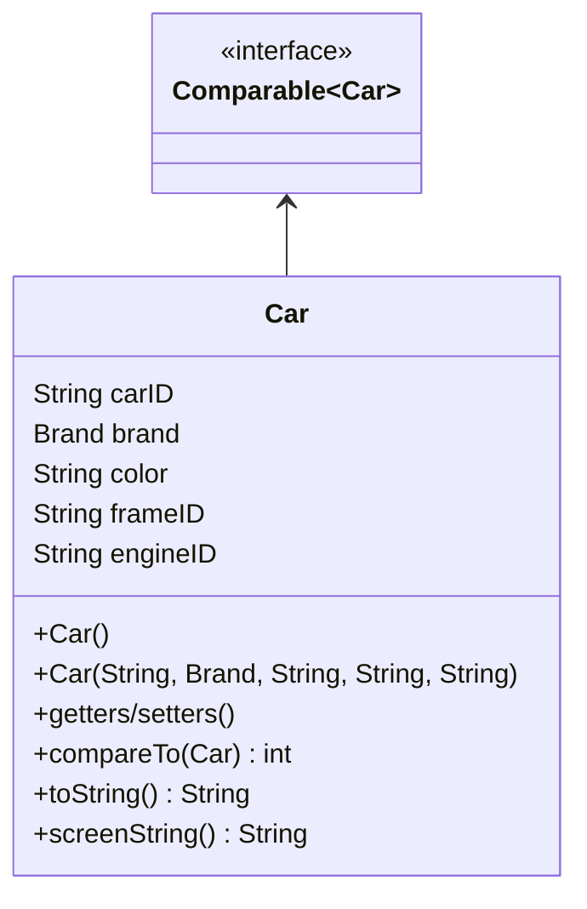

# PRO192 Assignment: CarManagement

## Table of contents

1. [Get this assignment](#1-get-this-assignment)

2. [Assignment requirements](#2-assignment-requirements)

3. [CodeTour](#3-codetour-recommended)

4. [Documentation](#4-documentation)

   4.1. [Before you use the documentation](#41-before-you-use-the-documentation)

   4.2. [UML Class Diagram](#42-uml-class-diagram)

   4.3. [Folder structure](#43-folder-structure)

   4.4. [`Menu` class](#44-menu-class)

   4.5. [`Brand` class](#45-brand-class)

   4.6. [`BrandList` class](#46-brandlist-class)

   4.7. [`Car` class](#47-car-class)

   4.8. [`CarList` class](#48-carlist-class)

   4.9. [`CarManager` class](#49-carmanager-class)

5. [Credits](#5-credits)

## 1. Get this assignment

Click [here](https://download-directory.github.io/?url=https://github.com/dung204/pro192/tree/main/CarManager) to download this assignment.

---

Or using this [`git`](https://git-scm.com/) command to download **ALL assignments**:

```
git clone https://github.com/dung204/pro192.git
```

> ⚠️: Credentials may be required.

## 2. Assignment requirements

The requirements are available in [`AS-Requirement_Cars.pdf`](./AS-Requirement_Cars.pdf)

## 3. CodeTour (recommended)

This assignment/test has a tour guide using [CodeTour](https://marketplace.visualstudio.com/items?itemName=vsls-contrib.codetour) extension. Follow the step from [here](../README.md#3-tour-guide-for-visual-studio-code-only) to install (if needed) and know how to use CodeTour for better experience.

## 4. Documentation

### 4.1. Before you use the documentation

- Click [here](../README.md#2-code-documentation) for more information.

### 4.2. UML Class Diagram

> 📝: _Zoom it yourself is recommended 🔎_



### 4.3. Folder structure

```
CarManager
├── brands.txt (Contains data of different brand)
├── cars.txt (Contains data of cars)
└── src (A directory to contain all source code)
    ├── CarManager.java (Contains menu to manage cars and brands)
    └── com (A package that store our core classes)
        ├── Brand.java
        ├── BrandList.java
        ├── Car.java
        ├── CarList.java
        └── Menu.java
```

### 4.4. [`Menu` class](./src/com/Menu.java)

---

- This class contains utilities to print out options and receive option input from user.

- Have look at its class diagram:



---

- From [line `25`](./src/com/Menu.java#L25), we can see that the `ref_getChoice()` method's return type is `E` and it receives an `ArrayList` of `E` type.

```java
public E ref_getChoice(ArrayList<E> options) {
```

- And the same `E` type for the parameter of [`int_getChoice()`](./src/com/Menu.java#L7) method:

```java
public int int_getChoice(ArrayList<E> options) {
```

- `E` here is a type that represent every possible data types (primitives, classes, interfaces, enums, ...). And this type can be apply to classes, methods, and properties (props). This is called _generics_, or "paramatized types" in Java. Generics allow any classes, props and methods to work with any "data types", and prevent code repetition (ex.: having to write the same method over and over for different data types)

- To use _generics_, all you need is to put `<E>` (or any letter you want inside the `<>`). And then you can apply `E` to any props or methods you want. Hence, in this case, we put `Menu<E>` instead of `Menu` only.

- For more information, check out:
  - [Generics in Java - GeeksforGeeks](https://www.geeksforgeeks.org/generics-in-java/)
  - [Generic Types (The Java™ Tutorials > Learning the Java Language > Generics (Updated))](https://docs.oracle.com/javase/tutorial/java/generics/types.html)

---

- The [`int_getChoice()`](./src/com/Menu.java#L7) simply prints out the options and receive an input as an integer from the user. In this method, we have to put a `try-catch` statement to handle when the user **DID NOT** enter an integer:

```java
int response;
try {
    // print the options and receive inputs
} catch (NumberFormatException e) { // if input is not an integer
    response = -1;
}
```

- The [`ref_getChoice()`](./src/com/Menu.java#L25) method is a wrapper function for the `int_getChoice()` method. It adds a loop to handle whenever the user pick an out-of-bound option. By looking at the condition of the loop, we understand why we set `response` to `-1` at `int_getChoice()` if user enter a not-a-number (NaN) value.

```java
int response;
do {
    ...
} while (response < 0 || response > options.size()); // response = -1 won't satisfy this
...
```

### 4.5. [`Brand` class](./src/com/Brand.java)

---

- This class is the representation of real-world car brands

- Have a look at the class diagram:



---

- In the [`toString()`](./src/com/Brand.java#L56) method, `String.format()` method is used:

```java
@Override
public String toString() {
    return String.format("%s, %s, %s: " + price, brandID, brandName, soundBrand);
}
```

- The `String.format()` method is pretty much like printf in C and Java, both receives a pattern string and values, then embed the value into the corresponding pattern. However, `String.format()` returns a String, while C's `printf` is a `void` function.

- For more information, check out [`String.format()` from official Java documentation](<https://docs.oracle.com/en/java/javase/20/docs/api/java.base/java/lang/String.html#format(java.lang.String,java.lang.Object...)>)

---

### 4.6. [`BrandList` class](./src/com/BrandList.java)

---

- This class is basically a list of brands ([`Brand`](#44-brand-class) objects).

- Here's the UML class diagram:



---

- At the definition of `BrandList` class, the class extends `ArrayList<Brand>`:

```java
public class BrandList extends ArrayList<Brand> {
```

- `ArrayList` is a mutable (able to add, delete, and modify value of the elements). It's a _generic_ class; hence, we also need to specify the class to use for the array (primitives are not allowed). In other words, ask yourself like: "what kind of thing do we want to store in this array?" or "is this a list of people, or a list of flowers, or a list ... of something?". "Kind of things" or "something" can be related to the class we specify for `ArrayList`.

- Earlier, I've mentioned that to use _generics_, we have to put <E> (or any other letter) next to the class name. That's we are defining that class to be generic (useable for any classes), `E` is like a "parameter", but for classes, **NOT** value.

- Think of defining a _generic_ class like defining a function (func). We specify the name of the func (same as defining the name of the class), specify the parameters and name them whatever you like (same as putting `<E>`, but I can use any letter I want, `T` for example).

- Then, when we extend any _generic_ class, we have to specify the "type" to use. This "type" has to be existed, not any arbitrary "type" or letter. Think of this just like invoking (calling, or using) a defined function, we specify existed variable or value as arguments. Here, we specify `Brand` the "type" we use for `ArrayList`. This can be understood as an array of `Brand`.

- For more information, check out:

  - [Generics in Java - GeeksforGeeks](https://www.geeksforgeeks.org/generics-in-java/)

  - [Generic Types (The Java™ Tutorials > Learning the Java Language > Generics (Updated))](https://docs.oracle.com/javase/tutorial/java/generics/types.html)

---

- In the constructor, I called `super()` - the constructor of `ArrayList`. However, I don't even need to do so. Why?

- Because `ArrayList` also has a default constructor (constructor with no parameters). Therefore, when we use the constructor of a class that _extends_ `ArrayList`, the `ArrayList` constructor will also be _implicitly_ called.

> ⚠️: if the parent class has a parametric constructor, we have to specify the `super()` and the corresponding parameters, or else the default constructor will be called instead.

---

- The [`loadFromFile()`](./src/com/BrandList.java#L14) and [`saveToFile()`](./src/com/BrandList.java#L29) method is returning `boolean` ??? We are only reading from and writing to file, so it should be `void`, isn't it?

- The `boolean` value retrieved from these functions signals whether we have read from/written to file successfully or not. Why "not" successful? Because we may encounter some errors (`Exception`s) that we might not pay attention. For example, what if the file does not exist, or the I/O (input/output) get broken, or we don't have permission to read or write, ...?

- In the `loadFromFile()` method, we use `Scanner` to read, but not from `System.in` (standard input) as we always use, but from a `File` object - representation of computer's file.

```java
Scanner in = new Scanner(new File(filename));
```

- Next, we setup a `while` loop to read from file, split the string and add a brand to the list. Pay attention to the condition `in.nextLine()` - it checks whenever the current `Scanner` still have to read (it will stop when it meets "end of file" (EOF)).

```java
while (in.hasNextLine()) {
    String[] brandData = in.nextLine().split("[,:]\\s*");
    this.add(new Brand(brandData[0], brandData[1], brandData[2], Double.parseDouble(brandData[3])));
}
```

- The `split` from `String` will split the original string into tokens based on its parameter (a `String` or a "regex" - "regular expression"). In this scenario, I'm using a regex, and here's its meaning:

  - `[,:]`: Accepts either `","` or `":"`
  - `\\s`: Accepts any whitespace characters (including spaces, tabs, line breaks)
  - `*`: The preceding character/character group (in this case: `\\s`) may appear or not.

- Example inputs and outputs:

```
"B5-18, BMW 530i (2018), Alpine: 2.599"`

--> ["B5-18", "BMW 530i (2018)", "Alpine", "2.599"]
```

```
"B3-S19,      BMW 320i Sportline (2019),Bose:1.899"

--> ["B3-S19", "BMW 320i Sportline (2019)", "Bose", "1.899"]
```

- After reading the file, please remember to close the `Scanner` instance:

```java
in.close();
```

- Of course, the process of reading from file might raise some error, `Exception`s (file not exists, I/O get broken somehow, file is not allowed to read, etc.). Therefore, we must put the code for reading file inside the `try-catch` block:

```java
try {
    // attempt to read the file
} catch (Exeception e) {
    this.clear();
    return false;
}
return true;
```

- We empty the list (`this.clear()`) to make sure there are no more leftovers for next time reading from file.

- And we also `return false` to signal that the reading process failed.

- In contrast, if everthing's fine, let's `return true`.

- The same pattern goes for `saveToFile()` method, you can [read it yourself](./src/com/BrandList.java#L29).

---

- The `getUserChoice()` method is a wrapper method for the `Menu.ref_getChoice()`. As you can see, earlier we define `Menu` class as a _generic_ class using `Menu<E>`. And now, we are using this class, we specify the "type", we use for `Menu` (in this case which is `Brand`). Hence, we have `Menu<Brand>`.

```java
public Brand getUserChoice() {
    return new Menu<Brand>().ref_getChoice(this);
}
```

- And because this `BrandList` class extends `ArrayList`, `this` will also be considered an `ArrayList` too. Therefore, we pass `this` as an argument to the `ref_getChoice()` method.

---

- The `listBrands()` method is fairly simple. In this case, we're using a special method from the `ArrayList` class - `forEach()`. It receives a function as an argument (huh ???), and apply the pattern from the function to all the elements of the `ArrayList`.

```java
public void listBrands() {
    this.forEach(System.out::println);
}
```

- The function I'm mentioning above, is called "action" function (in this scenario only, it has a lot of name, depending on different case we're dealing with). This function contains one compulsory parameter, which represents an element of the array, and the body of the function are the "actions" we apply to the element.

- This `listBrands()` method is actually equivalent to:

```java
public void listBrands() {
    for(int i = 0; i < this.size(); i++) {
        System.out.println(this.get(i));
    }
}
```

or:

```java
public void print(Brand brand) {
    System.out.println(brand);
}

public void listBrands() {
    this.forEach(print); // Note: "print" without brackets - ()
}
```

or:

```java
public void listBrands() {
    this.forEach(brand -> System.out.println(brand));
}
```

- This style of coding is well known as **functional programming**, we create a function to describe how the a single unit of data (an element of array, for example) becomes, or what actions to apply on that unit. I won't explain this too detail here, but feel free to check out some articles below:

  - [Functional programming - Wikipedia](https://en.wikipedia.org/wiki/Functional_programming)

  - [What is functional programming? A practical guide | InfoWorld](https://www.infoworld.com/article/3613715/what-is-functional-programming-a-practical-guide.html)

  - [Java Lambda Expressions - W3School](https://www.w3schools.com/java/java_lambda.asp)

  - [Lambda Expressions (The Java™ Tutorials > Learning the Java Language > Classes and Objects)](https://docs.oracle.com/javase/tutorial/java/javaOO/lambdaexpressions.html)

### 4.7. [`Car` class](./src/com/Car.java)

- A class that represents real-world cars

- Here's the UML class diagram:



---

- This class _implements_ `Comparable<Car>`. `Comparable` is an interface that offers utilities, and offers any other classes that implements this the ability to compare between instances (objects).

- The `Comparable` is a _generic_ interface, we can specify the "type" we use for the interface, or not. It's actually a good practice to specify the "type" for the `Comparable`, because the _`abstract`_ method of the interface - `compareTo()` takes an `Object` value as an argument (arg). If we specify the "type" - let's say `Car` for example, then `compareTo()` will take an `Car` instead of `Object` value as an arg. Then, we can use methods of `Car` directly, without having to manually cast from `Object` to `Car`

- `Comparable` is not only useful for comparing objects, but also for sorting a list of objects (via `Comparator` interface for `Collections.sort()`, or `Arrays.sort()`)

- For more information, check out:
  - [Comparable (Java SE 20 & JDK 20)](https://docs.oracle.com/en/java/javase/20/docs/api/java.base/java/lang/Comparable.html)

---

- Let's take a look at the [`compareTo()` method](./src/com/Car.java#L67), we are comparing `brandName`; if two `brandName`s are equal, we compare the `carID`s:

```java
@Override
public int compareTo(Car another) {
    int result = this.brand.brandName.compareTo(another.brand.brandName);
    return result != 0 ? result : this.carID.compareTo(another.carID);
}
```

- `compareTo()` is an _`abstract`_ method from `Comparable` interface. For anyone who've already forgotten: an _`abstract`_ method is a method without its body, just the name, return type, and the parameters. Any class that implements interface(s), or extends abstract class(es) that contains _`abstract`_ methods, have to override those methods.

- Back to `compareTo()` method, the return type of this method is `int` - an integer that indicates the result of the comparison: `0` if equal, `< 0` if `A` follows after `B`, and `> 0` if `A` preceeds `B`.

- Note: `A` is the object which call its `compareTo()` method, `B` is the object passed into the method as an argument.

- For more information, check out:
  - [compareTo() - Comparable (Java SE 20 & JDK 20)](<https://docs.oracle.com/en/java/javase/20/docs/api/java.base/java/lang/Comparable.html#compareTo(java.lang.Object)>)

---

- Also from `compareTo()` method, at [line 68](./src/com/Car.java#L68), we have another `compareTo()`:

```java
int result = this.brand.brandName.compareTo(another.brand.brandName);
```

- That `compareTo()` is actually the method from `Comparable` interface I mentioned earlier. However, `String` (and most Java built-in classes) has already implemented for you.

> 💡 Tip: navigate to [line 68 in the code](./src/com/Car.java#L68), right-click your mouse, select "Go to definition", or simply hit `F12` (by default) on your keyboard. Then scroll up until your find `public final class String ...`

### 4.8. [`CarList` class](./src/com/CarList.java)

- A class that represents a list of cars, pretty much like `BrandList`.

- This class has so many patterns in common with the `BrandList` class. Hence, I won't explain the methods too much and too detail. You can read all by yourself.

---

- In the `addCar()` method, [line 104](./src/com/CarList.java#L104):

```java
if (!frameID.matches("F\\d{5}"))
```

- Here, we have to make sure that `frameID` follows this format: `F00000`. In other words, we have to make sure it has a `F` character in the beginning, follow by 5 digits. Hence, we will use `matches()` method from `String` to verify whether a string matches a format. This regex (format) contains:

  - `F`: matches the character F

  - `\\d`: matches digits

  - `{5}`: preceeding tokens (`\\d` in this case) exactly 5 times.

- These string will satisfy: `"F12345"`, `"F99999"`, `"F44521"`, ...

- and these will not: `"F12"`, `"F"`, `"F3123123131"`, ...

- Same goes for the `engineID`. You can [try to parse the pattern yourself](./src/com/CarList.java#L115).

---

- Let's talk about [`listCars()`](./src/com/CarList.java#L215). This method sorts the list ascendingly (see [`compareTo()` method of `Car` class](./src/com/Car.java#L67)):

```java
  public void listCars() {
    // Listing cars in ascending order WITHOUT mutating the original array
    this.stream().sorted().forEach(car -> System.out.println(car.screenString()));
  }
```

- Earlier in the `BrandList` class, we use `forEach()` method of `ArrayList` to print out the elements. We're are still using here but we have to print `car.screenString()`, not `car.toString()`.

- The thing here is how I sort the list. Normally, we can use one of the two method (assume we have `list`, and this `list` is sortable):

```java
list.sort();
```

or:

```java
Collections.sort(list);
```

- However, this mutate the order of the list (i.e. the original version of the list has changed its order). To keep the original version, and get a cloned, sorted list, we use:

```java
list.stream().sorted();
```

- This return a `Stream` object, though. But if we want to return as a `List` object:

```java
list.stream().sorted().collect(Collectors.asList());
```

- And to convert that to an `ArrayList`, simply wrap the above code inside the `ArrayList` constructor, like this:

```java
new ArrayList(list.stream().sorted().collect(Collectors.asList()));
```

### 4.9. [`CarManager` class](./src/CarManager.java)

- This class uses all classes from the `com` package to create a program that manage information of cars.

- It has a menu with different options for user to choose, it let user input, enter their information, and we prompt them ... "politely"

- For a close look at `CarManager` class diagram, check out [4.1. UML Class Diagram](#41-uml-class-diagram).

---

- In the `main()` method, [line 14 to line 28](./src/CarManager.java#L14), we load information of brands and cars from `cars.txt` and `brands.txt`:

```java
BrandList brandList = new BrandList();
if (!brandList.loadFromFile("brands.txt")) {
    System.out.println("Cannot load brands from brands.txt. The program will be terminated.");
    in.close();
    System.exit(1);
}
System.out.println("Loading brands successfully!!");

CarList carList = new CarList(brandList);
if (!carList.loadFromFile("cars.txt")) {
    System.out.println("Cannot load cars from cars.txt. The program will be terminated.");
    in.close();
    System.exit(1);
}
System.out.println("Loading cars successfully!!");
```

- Here, we use `if-else` statement to handle the operation of loading from file. That's why the return type of `loadFromFile()` method should be `boolean` instead of `void`, when errors happen, we can easily prompt user that we can not get the information of cars and brands.

- And after prompting, here, we exit the program, since we don't have any information to work with.

---

- In the [`showMenuAndGetOption()`](./src/CarManager.java#L100) method, the `int_getChoice()` method from `Menu` class is capitalized:

```java
public static int showMenuAndGetOption() {
    ArrayList<String> options = new ArrayList<>(Arrays.asList(new String[] {
        "List all brands",
        "Add a new brand",
        "Search a brand based on its ID",
        "Update a brand",
        "Save brands to the file, named brands.txt",
        "List all cars in ascending order of brand names",
        "List cars based on a part of an input brand name",
        "Add a car",
        "Remove a car based on its ID",
        "Update a car based on its ID",
        "Save cars to file, named cars.txt"
    }));

    return new Menu<String>().int_getChoice(options);
}
```

- Here, we specify an array of options. In order to list out the `String`s directly for the array, we have to use primitive (normal) array:

```java
String[] options = new String[] {"a", "b", "c"};
```

- And then convert to an `ArrayList` like this:

```java
ArrayList<String> optionsList = new ArrayList<>(Arrays.asList(options));
```

> 📝: `Arrays.asList()` method convert an array to a `List` object, and then pass a `List` to the constructor of `ArrayList`, we get `ArrayList`.

- Combining two above steps, we have the code above for the method.

- _(Bonus)_: We can also use `ArrayList.add()` method:

```java
ArrayList<String> options = new ArrayList<>();

options.add("a");
options.add("b");
options.add("c");
```

- Then, we simply create a `Menu` instance (object), and call `int_getChoice()` method. Notice that, we're not creating a variable of class `Menu` and then invoke the `int_getChoice()` method, but we invoke the method, just right after create the object. Using this code-writing style, we don't have to think of names for a lot of variables anymore:

```java
return new Menu<String>().int_getChoice(options);
```

---

_(Bonus, it's good to know)_

> ## _There are only two hard things in Computer Science: cache validation and **naming things**._
>
> -- Phil Karlton --

---

- From here, the remaining code is ... easy to read. I will let you read the code by yourself. Thank you for reading 'till this point. I am so proud of you, you know 😀😀.

## 5. Credits

- This document is made by [@dung204](https://github.com/dung204/), and open for anyone.

- Do not copy, or re-upload this under any circumstances.
